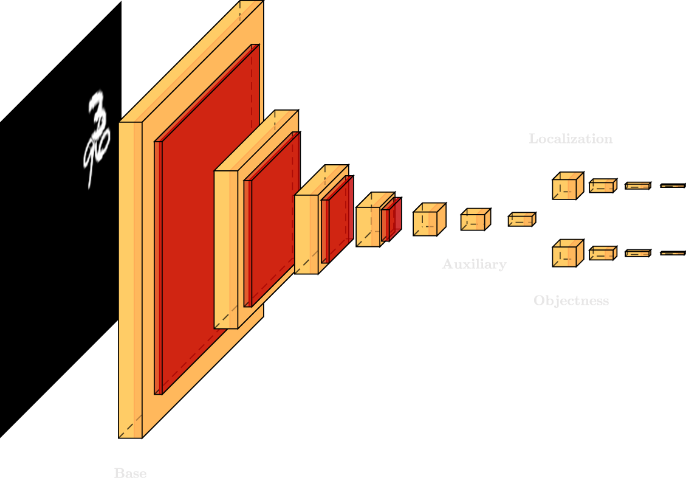
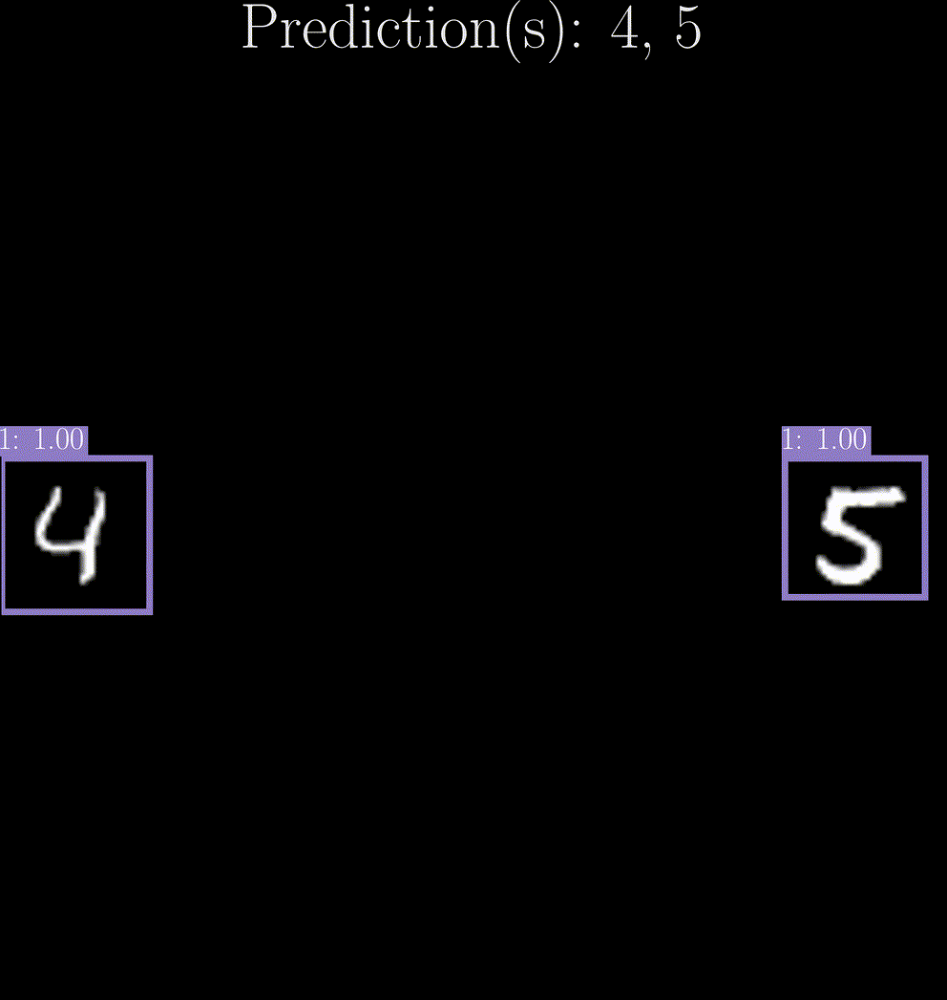

## Undergraduate Thesis

An undergraduate thesis on deep learning and object detection.

The accurate detection and classification of occluded objects in images present an ongoing challenge in the field of computer vision. This research introduces an approach to identifying and classifying occluded handwritten digits within 128x128px grayscale images. Our approach employs a model based on Single Shot Detector (SSD) that is designed for this purpose. The dataset incorporates both overlapping and non-overlapping MNIST digits. This is to simulate scenarios where object occlusion can decrease classification accuracy. Upon successful detection of a digit, it is encapsulated by a bounding box, and subsequently processed through a classification model. This classifier is trained on a modified version of the MNIST dataset that was augmented with noise. It is designed to increase the model's robustness against contamination and occlusion encountered during the detection process. Our findings demonstrate the model's effectiveness in accurately detecting and classifying occluded digits.

<p align="center">
    
</p>

<p align="center">
    
</p>

## Prerequisites

* [pyenv](https://github.com/pyenv/pyenv) or [Python 3.11.2](https://www.python.org/downloads/)


## Setup

### pyenv

```
pyenv install 3.11.2
```

```
pyenv local 3.11.2
```

### Virtual Environment

```
python -m venv venv
```

#### Windows

```
"venv/Scripts/activate"
```

#### Unix

```
source venv/bin/activate
```

### Packages

```
pip install -U -r requirements.txt
```
